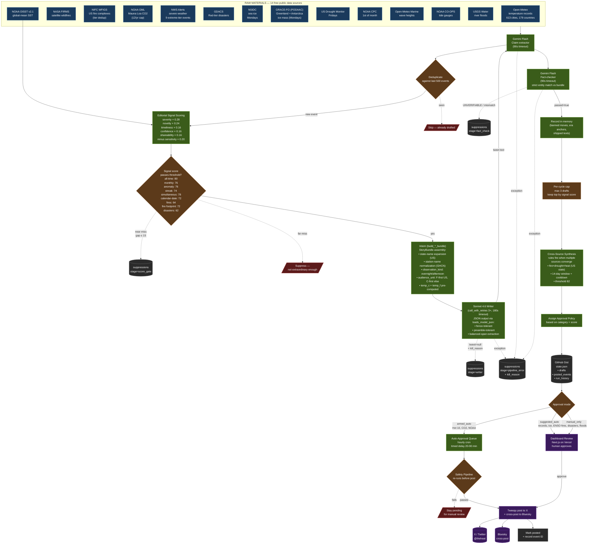

# @theheat Pipeline — From Raw Data to Published Tweet

**Last updated:** 2026-05-08 (post-port + suppression ledger).

A manufacturing-style flowchart showing how climate data becomes a tweet.

Each stage has a specific job; failure at any stage kills the draft rather than compromising quality. "Quality over volume" is enforced at multiple stages.

**Two-bot writer is live since 2026-05-04** (CHANGELOG 0.2.0.0). The voice generator is no longer reached on any live signal path — Sonnet 4.6 writes every audience-facing tweet, Gemini Flash runs claim extraction + fact-check.

**Suppression ledger is live since 2026-05-08** (CHANGELOG 0.3.x). Every kill at any stage records a structured row in `bot_state.suppressions` with `stage` discriminator (`score_gate` | `writer` | `fact_check` | `pipeline_error`) — the dashboard's `Suppressed` tab surfaces them in real time.

---

## The Flow

---

## Weekly Schedule (Source-Specific Gates)

Sources run on a schedule; most run with every alert cycle, but some are gated by day:

**Mondays:**
- **NSIDC sea ice** — Arctic/Antarctic extent + anomaly from reference period. Detects record lows. Capped at 8 tweets/year.
- **GRACE-FO ice mass (Lane 2)** — JPL PODAAC Level-4 mascon time series for Greenland + Antarctica. Two detectors: *monthly loss record* (largest single-month mass delta in the GRACE record) and *cumulative milestone* (each -1000 Gt floor crossed). Capped at 8 tweets/year across both regions. Requires `EARTHDATA_TOKEN`.

**Fridays:**
- **US Drought Monitor** — State-level drought intensity. Detects intensity tier changes.

**1st of month:**
- **NOAA CPC ENSO** — El Niño / La Niña transitions (Oceanic Niño Index).

**Sundays & Daily Limits:**
- **CO2 milestones** — Mauna Loa daily PPM. Capped at 12 tweets/year via `co2_annual_count` state.

---

## Stage Glossary

### Raw Materials (14 Sources)
Each source is fetched on a schedule (alerts every 4 hours, Hot 10 daily at 12:00 UTC). Each is wrapped in try/catch so one failure doesn't block the others.

### Deduplicate
Checks the event ID against the last 500 we've seen. Prevents drafting the same record twice. For evolving events like cyclones, the ID includes intensity tier so a Cat 3→Cat 4 strengthening produces a new event.

### Fire footprint tier dedup
Fire complexes evolve. The same fire burns bigger day after day, so the dedup event ID includes the hectare tier (`fire_footprint_<complex_id>_tier<N>`). A fire crossing 20k → 50k → 100k → 250k hectares produces one draft per threshold crossing, not one per day of burning. `state.fire_complex_tiers[complex_id]` remembers the last-notified tier; only strictly higher tiers are emitted. Mirrors the GDACS cyclone-tier pattern for Category 3→4 strengthening.

### Editorial Signal Scoring
Six weighted factors produce a 0–100 score. Each event type has a threshold (records: 72, fires: 64, disasters: 62, etc). Below threshold = suppressed before generation. This is the first quality gate.

### Build Data Description + Previous Drafts
Constructs the structured text the generator sees. For evolving events (cyclones, hurricanes), previous draft texts are included with explicit instructions NOT to repeat the same framing — prevents "Category 5 starts at 157" × 5 drafts.

### Gemini 2.5 Flash (Generator)
Fast, cheap, free tier. Produces 4 distinct tweet candidates from the data description. System prompt enforces voice rules, press-release bans, and the virality principles.

### Safety Pipeline
Two layers:
- **Regex:** 48+ banned patterns (emojis, hashtags, press-release openers, weather-service boilerplate, tell-don't-show meta-commentary, truncated temperatures, date repetition).
- **LLM:** Gemini Flash checks for mocking human suffering / crossing from dark humor into cruelty.

### Heuristic Ranking
Scores each surviving candidate on clarity/context/voice/punch. Orders them best-first.

### Claude Sonnet 4.6 (Virality Evaluator)
Second inference pass. Scores the top candidate 0–10 on five virality dimensions from the research:
- **Awe** — physical activation
- **Comparison** — concrete anchoring
- **Social currency** — makes the sharer look smart
- **Opener** — scroll-stopping first line
- **Show-not-tell** — no meta-commentary

Passes if 7+ on 4 of 5 dimensions. Fails otherwise. When failing, provides a rewrite.

### Rewrite Validation (3 gates)
The evaluator's rewrite must survive three checks to be accepted:
1. Pass the safety pipeline
2. Score higher than the original on the heuristic
3. No rewrite? Draft dies entirely.

**An evaluator FAIL with no usable rewrite kills the draft.** No more "evaluator said this isn't viral but we'll draft it anyway."

### Per-Cycle Cap
Max 3 drafts per alert cycle, ranked by signal score. Even on a hot day, only the top 3 survive. Forces quality over volume.

### State Write
All state lives in a single JSON file in a GitHub Gist. Read/written each run via GitHub API. Caps: 500 event IDs, 200 drafts, 50 errors, 10 tweets/day.

### Approval Policy
Three tiers determine what happens next:
- **armed_auto** — will auto-post after timed delay (Hot 10, CO2 milestones with strong scores)
- **suggested_auto** — dashboard suggests auto, but requires human (records, ice, ENSO)
- **manual_only** — human approval required (fires, severe weather, disasters, storm surge, river floods, drought)

### Cross-Source Synthesis

Runs once per alerts cycle after all per-source sections. Each rule
reads from the 14-day rolling buffer in `bot_state["synthesis_components"]`
and the cached USDM snapshot. When a rule's convergence conditions are
met and the per-(rule, state) cooldown is not active, a compound-framing
draft is generated through the full pipeline (candidates → safety →
ranking → evaluator → rewrite validation) and stored with
`suggested_auto` approval and a 120-minute delay.

### Dashboard
Next.js 15 + React 19 on Vercel free tier. Dark terminal aesthetic. Shows pending drafts sorted by signal + candidate score. Human approves, edits, or rejects.

### Post
Tweepy posts to X. If successful, cross-posts to Bluesky via AT Protocol. On rate-limit (429), stays pending for retry next hour.

### Double-Gate on Auto-Publish
Safety pipeline runs at generation time **AND** again right before every auto-post. Catches anything that slipped through initially.

---

## What Gets Killed vs What Gets Shipped

A tweet can die at any of these stages:

| Stage | Kill reason |
|---|---|
| Deduplicate | Already drafted this event |
| Signal scoring | Below threshold — not extraordinary enough |
| Safety (regex) | Banned pattern (press-release opener, weather-service boilerplate, truncated temp, etc) |
| Safety (LLM) | Mocks suffering, crosses into cruelty |
| Evaluator | Not viral enough, no usable rewrite |
| Rewrite safety | Evaluator's rewrite has a banned pattern |
| Rewrite regression | Rewrite scores worse than original on heuristic |
| Per-cycle cap | Not in top 3 for this run |
| Double-gate | Failed safety again right before auto-post |

Only drafts that survive every stage become tweets. On a typical alert cycle, hundreds of events get observed, dozens get scored, a handful make it to the generator, and 3 or fewer become drafts.

*A great tweet plus strong distribution beats a great tweet alone. A mediocre tweet plus amplification is just amplified mediocrity.*
