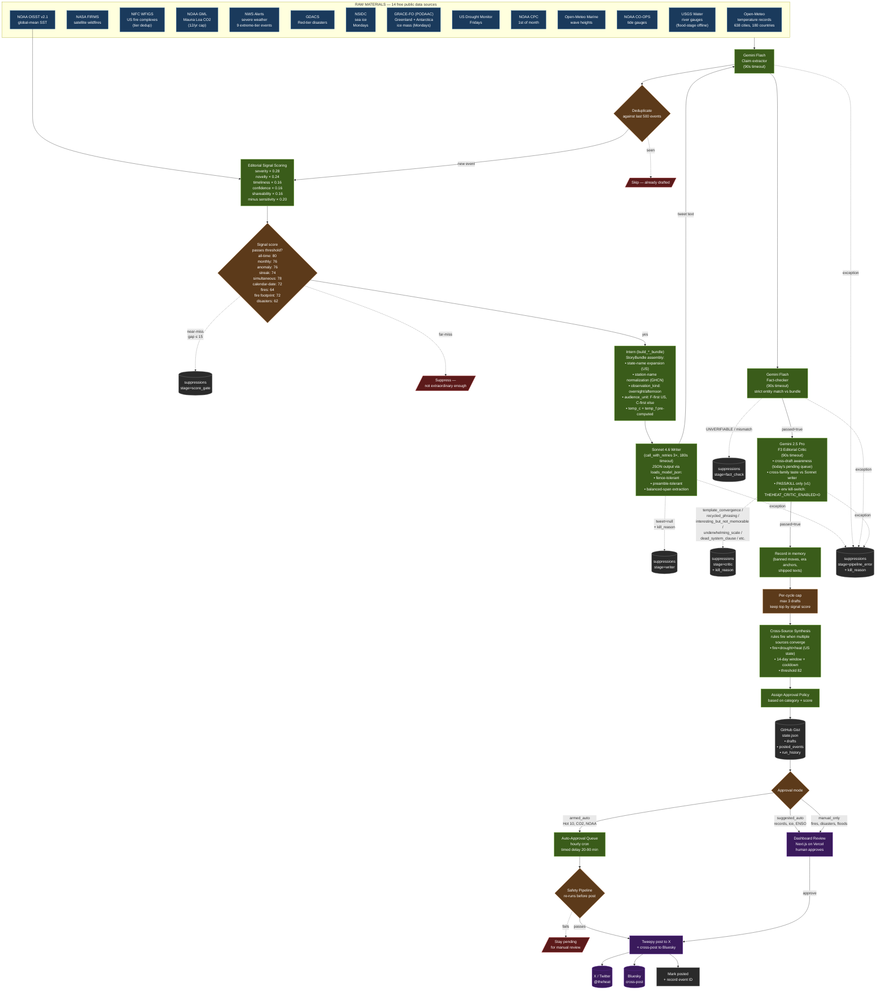

# @theheat Pipeline — From Raw Data to Published Tweet

**Last updated:** 2026-05-19 (post-cost-and-cap release: PRs #131 + #132 + #133 + #134 + #136 — see [CHANGELOG.md](/Users/andrewpuschel/Documents/Claude/theheat/CHANGELOG.md) 0.8.0.0).

**Architecture status (post-2026-05-19):** Deterministic triage stage now active between source detection and writer. Pipeline is `sources → TRIAGE (rank + per-category cap + global cap) → writer (Sonnet 4.6, prompt-cached) → safety → claim_extractor (Gemini Flash) → fact_check (Gemini Flash) → critic (Gemini 2.5 Pro) → pending`. The fact-checker accepts the writer's external climate-science / oceanography / geography knowledge as WORLD_KNOWLEDGE (canonical scales, named geography, IPCC AR6 framings, basic ocean / atmospheric mechanism) with primary-source confidence required; bundle stuffing is *not* the answer to UNVERIFIABLE rejections. The critic is the editorial-bar gate: cross-family with the writer for taste diversity, cross-draft-aware (sees today's pending queue) for template-convergence detection. Source layer unchanged from 0.7.0.0: 23 sources, `src/orchestrator/sources/`, `src/editorial/scoring/`, `src/two_bot/intern/`, thresholds centralized in `src/editorial/thresholds.py`, F2 enrichment via `src/data/_climate_context.py`. **Only `coral_dhw` is migrated to the triage path so far (PR #134); remaining sources still use the legacy direct-call path.** The drain helper handles both legacy direct-call drafts and triage survivors via the same `_try_two_bot_draft` gate.

**Anthropic prompt caching is live since 2026-05-19** (CHANGELOG 0.8.0.0 / #131). Both writer ([src/two_bot/writer.py](/Users/andrewpuschel/Documents/Claude/theheat/src/two_bot/writer.py)) and evaluator ([src/editorial/evaluator.py](/Users/andrewpuschel/Documents/Claude/theheat/src/editorial/evaluator.py)) mark their system prompt with `cache_control={"type": "ephemeral"}` on a structured content-block list. Cached-prefix input cost drops ~90% (reads ~0.1×; writes 1.25×; break-even at 2 reads). Writer system prompt is ~5,732 tokens, byte-stable. Tests at `tests/two_bot/test_writer_caching.py` + `tests/test_evaluator_caching.py` assert byte-identity so future refactors can't silently invalidate the cache.

**Deterministic pre-writer triage is live since 2026-05-19** (CHANGELOG 0.8.0.0 / #132 + #134). Implements the 2026-05-17 spec ([docs/superpowers/specs/2026-05-17-code-first-triage-design.md](/Users/andrewpuschel/Documents/Claude/theheat/docs/superpowers/specs/2026-05-17-code-first-triage-design.md)). New `src/orchestrator/triage.py` exposes `select_survivors(bot_state, queue)` — ranks by `(score.total DESC, created_at DESC)`, applies per-category cap (default 2 via `THEHEAT_PER_CATEGORY_CAP`), applies global cap (`MAX_DRAFTS_PER_CYCLE = 3`). Sources call `_enqueue_candidate(bot_state, TriageCandidateBundle(...))` instead of `_try_two_bot_draft` directly; the drain step at end-of-cycle (`_drain_and_write_triage_queue` in `src/orchestrator/common.py`) ranks, caps, writes survivors, and credits per-source `drafted` telemetry. Spilled candidates land in the suppression ledger with `kill_stage="triage_cap"`. Kill-switch: `THEHEAT_TRIAGE_ENABLED` env var (defaults `"0"` in code; production overrides to `"1"` via `bot.yml`). Triage exceptions fall through to legacy passthrough — the drain writes everything in queue order and logs `[triage] error: ...`. The `TriageCandidateBundle.on_draft_success` callback (added in #134) lets sources defer side effects (e.g. `state.update_coral_dhw_tier`) until a draft actually ships, preserving the spec § 7 contract that spilled candidates re-detect on next cron.

A manufacturing-style flowchart showing how climate data becomes a tweet.

Each stage has a specific job; failure at any stage kills the draft rather than compromising quality. "Quality over volume" is enforced at multiple stages — operationally, **quality means passing the two-gate shareability test: stop-mid-scroll + send-it-to-a-friend**. Both gates required.

**Two-bot writer is live since 2026-05-04** (CHANGELOG 0.2.0.0). The voice generator is no longer reached on any live signal path — Sonnet 4.6 writes every audience-facing tweet, Gemini Flash runs claim extraction + fact-check, Gemini 2.5 Pro runs the second-pass editorial critic.

**Suppression ledger is live since 2026-05-08** (CHANGELOG 0.3.x; extended for `critic` stage in 0.7.1.0 / #120, and for `claim_extractor` + `budget_exhausted` in 0.7.2.0 / #126 + #127). Every kill at any stage records a structured row in `bot_state.suppressions` with `stage` discriminator (`score_gate | writer | safety | claim_extractor | fact_check | critic | budget_exhausted | pipeline_error | cycle_cap | unknown`) — the dashboard's `Suppressed` tab surfaces them in real time. A future `triage_cap` stage is reserved for the deterministic pre-writer triage stage spec'd in [docs/superpowers/specs/2026-05-17-code-first-triage-design.md](/Users/andrewpuschel/Documents/Claude/theheat/docs/superpowers/specs/2026-05-17-code-first-triage-design.md) (not yet implemented).

**BudgetExhaustedError tagging is live since 2026-05-17** (CHANGELOG 0.7.2.0 / #127). The retry helper at [src/two_bot/retry.py](/Users/andrewpuschel/Documents/Claude/theheat/src/two_bot/retry.py) now detects the Anthropic 400 "credit balance is too low" pattern, short-circuits the retry loop, and raises `BudgetExhaustedError`. The pipeline catches it before generic `Exception` and records `kill_stage="budget_exhausted"` — so the dashboard surfaces a billing outage distinctly from a model/code bug (the 2026-05-15 → 2026-05-17 outage produced 182 indistinguishable `pipeline_error` rows; this fix would have made it diagnosable in one row).

**GPM-IMERG diagnostics + city cap are live since 2026-05-17** (CHANGELOG 0.7.2.0 / #126 + #128). The data fetcher at [src/data/gpm_imerg.py](/Users/andrewpuschel/Documents/Claude/theheat/src/data/gpm_imerg.py) captures the first per-city HTTP failure (status + URL via `requests.HTTPError.response`) and threads it into both the strict-mode `SourceFetchError` and a one-line stdout log. Future GPM failures show `HTTP 401 from <opendap-url>` instead of an opaque `(N failed)` count. The per-cron city scan defaults to 75 (was 638), overridable via `GPM_IMERG_MAX_CITIES`.

**Claim-extractor failure tagging is live since 2026-05-17** (CHANGELOG 0.7.2.0 / #126). Pipeline wraps `claim_extractor.extract_claims()` in try/except and records `kill_stage="claim_extractor"` instead of letting the exception bubble to generic `pipeline_error`. Claim-extractor also gained JSON-parse retry parity with writer/fact_check/critic (mirrors #121 from 0.7.1.0) — single retry with contract-reminder suffix before raising.

**Deterministic pre-writer triage is spec'd, not implemented** (CHANGELOG 0.7.2.0 / #129). [docs/superpowers/specs/2026-05-17-code-first-triage-design.md](/Users/andrewpuschel/Documents/Claude/theheat/docs/superpowers/specs/2026-05-17-code-first-triage-design.md) lays out the architecture for a new `src/orchestrator/triage.py` stage between `intern` (bundle build) and `writer` (LLM tweet composition). Sources will build candidate bundles and append to a per-cycle queue; the orchestrator ranks by editorial score, enforces a per-category cap (max 2 per `signal_kind`) + global cap (`MAX_DRAFTS_PER_CYCLE`), and sends only survivors to writer. Spilled candidates record `kill_stage="triage_cap"`. Target: source-growth-proof flat-line cost — doubling sources should not double credit burn. Spec passed `/plan-eng-review` 2026-05-17 with 6 findings folded in. Kill-switch: `THEHEAT_TRIAGE_ENABLED=0`.

**Writer-side guardrails are live since 2026-05-12** (CHANGELOG 0.5.0.0 + 0.5.1.0). The Sonnet writer is wrapped in two retry loops with declarative-only feedback: a **length-cap retry** (#76) reattempts up to 2x if a tweet > 280 chars, then KILLS with `kill_reason`; a **JSON-parse retry** (#82) reattempts 1x if the model returns non-JSON, then KILLS with `kill_reason`. Neither path crashes the pipeline. Twitter never sees over-length or malformed output regardless of model sampling.

**JSON-parse retry parity for Gemini callers is live since 2026-05-15** (CHANGELOG 0.7.1.0 / #121). The writer's JSON-parse retry pattern is now mirrored into `fact_check.fact_check()` and `critic.critic_review()`. Each `_call_gemini` gains an optional `retry_suffix` kwarg appended to the user prompt; the caller wraps `_call_gemini` + `_parse_*_json` in a retry loop (`JSON_PARSE_RETRY_BUDGET = 1`) and appends a contract-reinforcement message on the second attempt. On exhaustion, both fail-closed with structured KILL/REJECT — `FactCheckResult(passed=False, failures=["...invalid JSON across 2 attempts..."])` and `CriticResult(passed=False, kill_reason="...invalid JSON across 2 attempts...")` — so the suppression ledger categorizes the failure as a clean fact_check / critic kill instead of pipeline_error.

**F3 second-pass editorial critic is live since 2026-05-15** (CHANGELOG 0.7.1.0 / #120). After fact_check passes, Gemini 2.5 Pro reviews the draft against the editorial bar (stop-mid-scroll + send-it-to-a-friend) AND against today's pending drafts (cross-draft awareness — catches template convergence the writer can't self-detect because the writer's `recent_categories` only fires against shipped / 24h-cooldown history, not in-flight siblings). PASS/KILL only in v1; no rewrite loop. Bias toward KILL on borderline. Operations kill-switch via `THEHEAT_CRITIC_ENABLED=0`. Cost: ~$0.30–$0.60/day at current volume.

**Fact-check WORLD_KNOWLEDGE is generous since 2026-05-15** (CHANGELOG 0.7.1.0 / #119). The fact-checker treats canonical published scales (NOAA Coral Reef Watch DHW Alert Levels 1–5, Saffir-Simpson, Beaufort, Fujita/EF, VEI, Drought Monitor D0–D4, GDACS tiers), named marine + physical geography (seas, channels, basins, reef systems, archipelagos, currents), IPCC AR6-grade climate framings, and basic ocean / atmospheric mechanism as WORLD_KNOWLEDGE — they don't need to be in the bundle. Narrow UNVERIFIABLE guards still catch named-facility specifics (Hoover Dam MW etc.), snapshot-trend claims without a bundle trend field, arithmetic that doesn't compute, ungrounded comparative superlatives, and fabricated archive specifics. Disposition: primary-source confidence is required (clearly established by NOAA / IPCC / NASA / NSIDC / USGS / WMO → ACCEPT; plausible / vibes-based → UNVERIFIABLE).

**Bundle-side normalization is live since 2026-05-12** (CHANGELOG 0.5.0.0 + 0.5.1.0). FRP gets `round(fire.frp, 1)` in `intern.build_fire_bundle` (#80); GHCN station names get COOP (`4 NE`) + military (`ANG`) suffix stripping in `normalize_station_name` (#82). Bundle becomes the single source of truth so the fact-checker's exact-match contract holds naturally.

**FRP intensity tier is queued in PR #85** (CHANGELOG unreleased 2026-05-13). Fire bundle's `current_facts` will carry `frp_tier` (low/moderate/high/very_high) and `frp_tier_floor_mw` (0/30/100/500) so the writer can give readers a scale-word ("high-intensity at 309 MW") instead of opaque raw megawatts. Bundle-side computation; writer-side citation; no NASA/FIRMS attribution.

**Belt-and-suspenders city normalization is queued in PR #84** (CHANGELOG unreleased 2026-05-13). The 4 GHCN-touching bundle builders will defensively call `normalize_station_name()` on `ev.city` before composing the bundle's `where`, `current_facts.city`, and `raw_signal_dump.city`. Production is already safe via ghcn.py:381 upstream; this is boundary defense.

**Per-day category cooldown via MemorySlice is queued in PR #85** (CHANGELOG unreleased 2026-05-13). The memory layer will expose `recent_categories` — signal categories already posted in the last 24 hours. The writer reads this and self-vetoes a same-category draft unless it offers meaningfully different mechanic / geography / scale. Closes the "two fires in a row" pacing failure observed in the 2026-05-12 pending queue and the 2026-05-13 first graded cycle.

**Gist state truncation is queued in PR #87** (CHANGELOG unreleased 2026-05-13). GitHub Gists REST API truncates `content` at ~900 KB. When state grows past that, `_read_gist_state` will follow `raw_url` for the full payload instead of crashing on a truncated JSON tail. Three runs failed today on this; #87 makes it permanent.

---

## The Flow

---

## Weekly Schedule (Source-Specific Gates)

Sources run on a schedule; most run with every alert cycle, but some are gated by day:

**Mondays:**
- **NSIDC sea ice** — Arctic/Antarctic extent + anomaly from reference period. Detects record lows. Capped at 8 tweets/year.
- **GRACE-FO ice mass (Lane 2)** — JPL PODAAC Level-4 mascon time series for Greenland + Antarctica. Two detectors: *monthly loss record* (largest single-month mass delta in the GRACE record) and *cumulative milestone* (each -1000 Gt floor crossed). Capped at 8 tweets/year across both regions. Requires `EARTHDATA_TOKEN`.

**Fridays:**
- **US Drought Monitor** — State-level drought intensity. Detects intensity tier changes.

**1st of month:**
- **NOAA CPC ENSO** — El Niño / La Niña transitions (Oceanic Niño Index).

**Sundays & Daily Limits:**
- **CO2 milestones** — Mauna Loa daily PPM. Capped at 12 tweets/year via `co2_annual_count` state.

---

## Stage Glossary

### Raw Materials (14 Sources)
Each source is fetched on a schedule (alerts every 4 hours, Hot 10 daily at 12:00 UTC). Each is wrapped in try/catch so one failure doesn't block the others.

### Deduplicate
Checks the event ID against the last 500 we've seen. Prevents drafting the same record twice. For evolving events like cyclones, the ID includes intensity tier so a Cat 3→Cat 4 strengthening produces a new event.

### Fire footprint tier dedup
Fire complexes evolve. The same fire burns bigger day after day, so the dedup event ID includes the hectare tier (`fire_footprint_<complex_id>_tier<N>`). A fire crossing 20k → 50k → 100k → 250k hectares produces one draft per threshold crossing, not one per day of burning. `state.fire_complex_tiers[complex_id]` remembers the last-notified tier; only strictly higher tiers are emitted. Mirrors the GDACS cyclone-tier pattern for Category 3→4 strengthening.

### Editorial Signal Scoring
Six weighted factors produce a 0–100 score. Each event type has a threshold (records: 72, fires: 64, disasters: 62, etc). Below threshold = suppressed before generation. This is the first quality gate.

### Build Data Description + Previous Drafts
Constructs the structured text the generator sees. For evolving events (cyclones, hurricanes), previous draft texts are included with explicit instructions NOT to repeat the same framing — prevents "Category 5 starts at 157" × 5 drafts.

### Gemini 2.5 Flash (Generator)
Fast, cheap, free tier. Produces 4 distinct tweet candidates from the data description. System prompt enforces voice rules, press-release bans, and the virality principles.

### Safety Pipeline
Two layers:
- **Regex:** 48+ banned patterns (emojis, hashtags, press-release openers, weather-service boilerplate, tell-don't-show meta-commentary, truncated temperatures, date repetition).
- **LLM:** Gemini Flash checks for mocking human suffering / crossing from dark humor into cruelty.

### Heuristic Ranking
Scores each surviving candidate on clarity/context/voice/punch. Orders them best-first.

### Claude Sonnet 4.6 (Virality Evaluator)
Second inference pass. Scores the top candidate 0–10 on five virality dimensions from the research:
- **Awe** — physical activation
- **Comparison** — concrete anchoring
- **Social currency** — makes the sharer look smart
- **Opener** — scroll-stopping first line
- **Show-not-tell** — no meta-commentary

Passes if 7+ on 4 of 5 dimensions. Fails otherwise. When failing, provides a rewrite.

### Rewrite Validation (3 gates)
The evaluator's rewrite must survive three checks to be accepted:
1. Pass the safety pipeline
2. Score higher than the original on the heuristic
3. No rewrite? Draft dies entirely.

**An evaluator FAIL with no usable rewrite kills the draft.** No more "evaluator said this isn't viral but we'll draft it anyway."

### Per-Cycle Cap
Max 3 drafts per alert cycle, ranked by signal score. Even on a hot day, only the top 3 survive. Forces quality over volume.

### State Write
All state lives in a single JSON file in a GitHub Gist. Read/written each run via GitHub API. Caps: 500 event IDs, 200 drafts, 50 errors, 10 tweets/day.

### Approval Policy
Three tiers determine what happens next:
- **armed_auto** — will auto-post after timed delay (Hot 10, CO2 milestones with strong scores)
- **suggested_auto** — dashboard suggests auto, but requires human (records, ice, ENSO)
- **manual_only** — human approval required (fires, severe weather, disasters, storm surge, river floods, drought)

### Cross-Source Synthesis

Runs once per alerts cycle after all per-source sections. Each rule
reads from the 14-day rolling buffer in `bot_state["synthesis_components"]`
and the cached USDM snapshot. When a rule's convergence conditions are
met and the per-(rule, state) cooldown is not active, a compound-framing
draft is generated through the full pipeline (candidates → safety →
ranking → evaluator → rewrite validation) and stored with
`suggested_auto` approval and a 120-minute delay.

### Dashboard
Next.js 15 + React 19 on Vercel free tier. Dark terminal aesthetic. Shows pending drafts sorted by signal + candidate score. Human approves, edits, or rejects.

### Post
Tweepy posts to X. If successful, cross-posts to Bluesky via AT Protocol. On rate-limit (429), stays pending for retry next hour.

### Double-Gate on Auto-Publish
Safety pipeline runs at generation time **AND** again right before every auto-post. Catches anything that slipped through initially.

---

## What Gets Killed vs What Gets Shipped

A tweet can die at any of these stages:

| Stage | Kill reason |
|---|---|
| Deduplicate | Already drafted this event |
| Signal scoring | Below threshold — not extraordinary enough |
| Safety (regex) | Banned pattern (press-release opener, weather-service boilerplate, truncated temp, etc) |
| Safety (LLM) | Mocks suffering, crosses into cruelty |
| Evaluator | Not viral enough, no usable rewrite |
| Rewrite safety | Evaluator's rewrite has a banned pattern |
| Rewrite regression | Rewrite scores worse than original on heuristic |
| Per-cycle cap | Not in top 3 for this run |
| Double-gate | Failed safety again right before auto-post |

Only drafts that survive every stage become tweets. On a typical alert cycle, hundreds of events get observed, dozens get scored, a handful make it to the generator, and 3 or fewer become drafts.

*A great tweet plus strong distribution beats a great tweet alone. A mediocre tweet plus amplification is just amplified mediocrity.*
