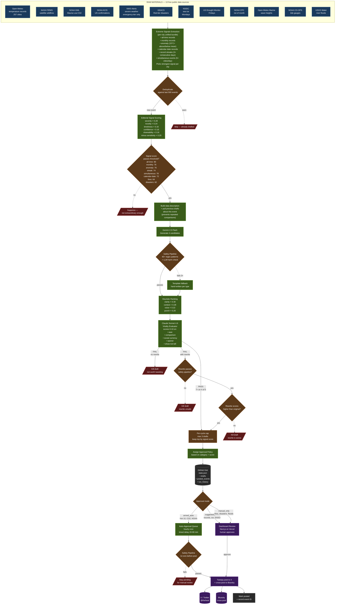

# @theheat Pipeline — From Raw Data to Published Tweet

A manufacturing-style flowchart showing how climate data becomes a tweet.

Each stage has a specific job; failure at any stage kills the draft rather than compromising quality. "Quality over volume" is enforced at multiple stages.

---

## The Flow

---

## Stage Glossary

### Raw Materials (13 Sources)
Each source is fetched on a schedule (alerts every 4 hours, Hot 10 daily at 12:00 UTC). Each is wrapped in try/catch so one failure doesn't block the others.

### Deduplicate
Checks the event ID against the last 500 we've seen. Prevents drafting the same record twice. For evolving events like cyclones, the ID includes intensity tier so a Cat 3→Cat 4 strengthening produces a new event.

### Editorial Signal Scoring
Six weighted factors produce a 0–100 score. Each event type has a threshold (records: 72, fires: 64, disasters: 62, etc). Below threshold = suppressed before generation. This is the first quality gate.

### Build Data Description + Previous Drafts
Constructs the structured text the generator sees. For evolving events (cyclones, hurricanes), previous draft texts are included with explicit instructions NOT to repeat the same framing — prevents "Category 5 starts at 157" × 5 drafts.

### Gemini 2.5 Flash (Generator)
Fast, cheap, free tier. Produces 4 distinct tweet candidates from the data description. System prompt enforces voice rules, press-release bans, and the virality principles.

### Safety Pipeline
Two layers:
- **Regex:** 48+ banned patterns (emojis, hashtags, press-release openers, weather-service boilerplate, tell-don't-show meta-commentary, truncated temperatures, date repetition).
- **LLM:** Gemini Flash checks for mocking human suffering / crossing from dark humor into cruelty.

### Heuristic Ranking
Scores each surviving candidate on clarity/context/voice/punch. Orders them best-first.

### Claude Sonnet 4.6 (Virality Evaluator)
Second inference pass. Scores the top candidate 0–10 on five virality dimensions from the research:
- **Awe** — physical activation
- **Comparison** — concrete anchoring
- **Social currency** — makes the sharer look smart
- **Opener** — scroll-stopping first line
- **Show-not-tell** — no meta-commentary

Passes if 7+ on 4 of 5 dimensions. Fails otherwise. When failing, provides a rewrite.

### Rewrite Validation (3 gates)
The evaluator's rewrite must survive three checks to be accepted:
1. Pass the safety pipeline
2. Score higher than the original on the heuristic
3. No rewrite? Draft dies entirely.

**An evaluator FAIL with no usable rewrite kills the draft.** No more "evaluator said this isn't viral but we'll draft it anyway."

### Per-Cycle Cap
Max 3 drafts per alert cycle, ranked by signal score. Even on a hot day, only the top 3 survive. Forces quality over volume.

### State Write
All state lives in a single JSON file in a GitHub Gist. Read/written each run via GitHub API. Caps: 500 event IDs, 200 drafts, 50 errors, 10 tweets/day.

### Approval Policy
Three tiers determine what happens next:
- **armed_auto** — will auto-post after timed delay (Hot 10, CO2 milestones, NOAA confirmations with strong scores)
- **suggested_auto** — dashboard suggests auto, but requires human (records, ice, ENSO)
- **manual_only** — human approval required (fires, severe weather, disasters, storm surge, river floods, drought)

### Dashboard
Next.js 15 + React 19 on Vercel free tier. Dark terminal aesthetic. Shows pending drafts sorted by signal + candidate score. Human approves, edits, or rejects.

### Post
Tweepy posts to X. If successful, cross-posts to Bluesky via AT Protocol. On rate-limit (429), stays pending for retry next hour.

### Double-Gate on Auto-Publish
Safety pipeline runs at generation time **AND** again right before every auto-post. Catches anything that slipped through initially.

---

## What Gets Killed vs What Gets Shipped

A tweet can die at any of these stages:

| Stage | Kill reason |
|---|---|
| Deduplicate | Already drafted this event |
| Signal scoring | Below threshold — not extraordinary enough |
| Safety (regex) | Banned pattern (press-release opener, weather-service boilerplate, truncated temp, etc) |
| Safety (LLM) | Mocks suffering, crosses into cruelty |
| Evaluator | Not viral enough, no usable rewrite |
| Rewrite safety | Evaluator's rewrite has a banned pattern |
| Rewrite regression | Rewrite scores worse than original on heuristic |
| Per-cycle cap | Not in top 3 for this run |
| Double-gate | Failed safety again right before auto-post |

Only drafts that survive every stage become tweets. On a typical alert cycle, hundreds of events get observed, dozens get scored, a handful make it to the generator, and 3 or fewer become drafts.

*A great tweet plus strong distribution beats a great tweet alone. A mediocre tweet plus amplification is just amplified mediocrity.*
