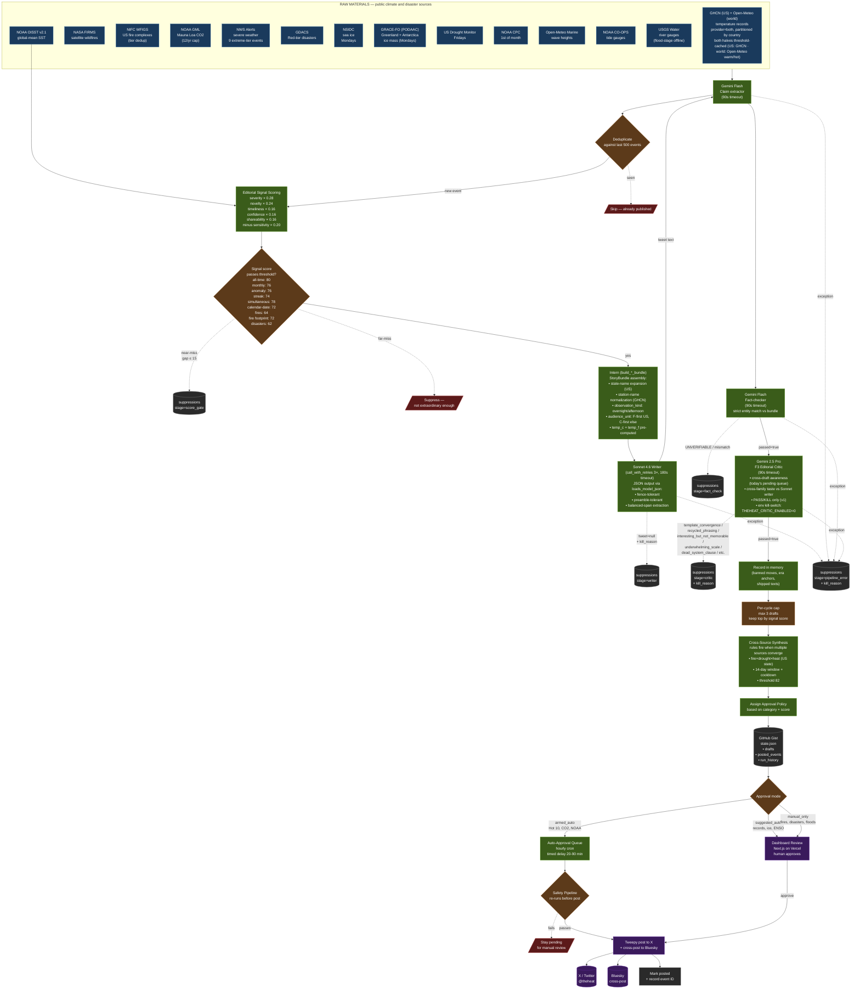

# @theheat Pipeline — From Raw Data to Published Tweet

**Last updated:** 2026-07-08 (version 0.9.97.0). Authoritative current state:
[/Users/andrewpuschel/Documents/Claude/theheat/docs/handoffs/2026-07-08.md](/Users/andrewpuschel/Documents/Claude/theheat/docs/handoffs/2026-07-08.md).
The editorial pipeline shape described below is unchanged; the source layer is
resilient and observable. The **front-page-parity program's every EXECUTABLE row is
MERGED** (3/4/5/6/7/9/11/14) — including row-9 engagement capture (#412) and the
editorial follow-ups #401 (#408, precip threshold cross-gate) + #403 (#409, DHW full
NOAA scale). **Bet A is FULLY LIVE: A0 `THEHEAT_NEWSWORTHINESS_ENABLED` (2026-07-07
12:59Z) + A1 `THEHEAT_NEWS_ENRICH_ENABLED` (16:23Z) + A2 `THEHEAT_NEWS_BOOST_ENABLED`
(20:42Z)**, plus `THEHEAT_PER_COUNTRY_CAP=2` (20:42Z) and `THEHEAT_METRICS_ENABLED`
(row 9, 22:43Z). Boost/cap watch regression-clean; no boost has fired yet (rare). The
heat-dome coverage story is the **global records-cluster (#414, spiked GO #416)** —
the next build; the US-only row-13 population-extent was reverted (#417) as off-brand.
Remaining rows gated on data/time: 8 / 10 / 12. Statuses in
[the INDEX](/Users/andrewpuschel/Documents/Claude/theheat/docs/superpowers/plans/front-page-parity/INDEX.md).

**The newsworthiness lane exists since 2026-07-04, LIVE since 2026-07-07** ([#366](https://github.com/andrewzp/theheat/pull/366);
Bet A phase 0 of the [three-pillar plan](/Users/andrewpuschel/Documents/Claude/theheat/docs/superpowers/plans/2026-07-03-three-pillar-upgrade-plan.md),
design [spec](/Users/andrewpuschel/Documents/Claude/theheat/docs/superpowers/specs/2026-07-03-newsworthiness-bet-a-design.md)).
A flag-gated source runner (`THEHEAT_NEWSWORTHINESS_ENABLED`, unset=OFF) retrieves
cited world events per alerts cycle — a NIFC/WFIGS leg (live-verified field
contract: personnel/size/cost; **no fatality fields exist there**) plus one Gemini
`google_search` grounded call whose events are **verified-or-dropped per impact
entry** (independent fetch of the cited URL + a separate Flash support check, ≤3
fetches/cycle). Deterministic floor: any impact entry missing
`source_name`/`url`/`as_of` is dropped at parse time. Results land in
`state["news_events"]` (7-day window); every enqueued candidate is registered in
`state["candidates_log"]`; the sentinel's **news-gap watch** opens an advisory
issue when a verified world event matches nothing we detected — the miss-detector
for the European-heat-deaths class. Phase 0 has ZERO editorial surface; **A1
(enrich: `human_impact` on bundles → sourced anecdotes) and A2 (rescue-capped
score boost) are next**, each behind its own default-OFF flag. Code:
`src/data/newsworthiness.py`, `src/orchestrator/sources/newsworthiness.py`.

**The sentinel fails loudly on five fronts since 2026-07-03/04** (reliability
pillar): per-source failing issues + yield watch + coverage watch (heat) +
**writer watch** ([#362](https://github.com/andrewzp/theheat/pull/362) — recent
`budget_exhausted` kills while the bot drafts → loud auto-closing issue; the
2026-07-03 silent credits outage class) + **queue watch**
([#364](https://github.com/andrewzp/theheat/pull/364) — pending human-gated
drafts older than 24h; auto-owned means `auto_approve_at` + `approval_mode` ∈
{auto, policy_auto}, never the policy recommendation) + the **news-gap watch**
(above, flag-gated). JS mirrors live in `dashboard/lib/source-health.js`
(`writerWatch`/`queueWatch` in `buildSourceHealthPayload`). A **time-travel
canary** ([#365](https://github.com/andrewzp/theheat/pull/365)) runs the whole
suite weekly at +30d/+365d (`THEHEAT_TIME_TRAVEL_DAYS` via `tests/conftest.py`)
so calendar time-bombs fail there before they detonate on `main` — its first
+90d run found five live bombs (all fixed; fixtures are now today-relative).
workflow-health monitors FIVE scheduled workflows (canary included).

**Production drafting no longer gates on the full unit-test suite since 2026-06-23**
([#326](https://github.com/andrewzp/theheat/pull/326)). A flaky time-bomb unit test
(hardcoded dates that detonated on 2026-06-19) had gated the bot's `run` job via
`needs: test` and silently halted all drafting for a weekend, masked because the
`:30` `auto_publish_due` cron skips the test job and kept passing. The `bot.yml`
`test` job now runs on `pull_request` ONLY; scheduled drafting runs skip it and pass
a fast deterministic **Smoke gate** (`ruff check src/` + `python -c "import src.main"`)
instead, so a flaky unit test can no longer block — or redden — production drafting.
The full suite still gates every PR merge; drafts are manual-gated, so the residual
risk is a rejected draft, not a bad tweet.

**Credential-expiry counters are live since 2026-06-23** ([#330](https://github.com/andrewzp/theheat/pull/330);
needs a `vercel --prod` deploy to render). The 60-day NASA `EARTHDATA_TOKEN` aged out
and 401'd every GPM path with no warning. [/Users/andrewpuschel/Documents/Claude/theheat/src/credentials.py](/Users/andrewpuschel/Documents/Claude/theheat/src/credentials.py)
now decodes the `exp` claim from JWT credentials each run (only the derived date is
written to state under `credential_expiry`; the token never leaves the bot) and the
dashboard shows a **CREDENTIALS** card (days-until-expiry, green/amber/red). Adding
the next credential is one row in `TRACKED_CREDENTIALS`.

**The world temperature half is cache-backed since 2026-06-26** ([#338](https://github.com/andrewzp/theheat/pull/338)).
In `provider=both`, the US half has always used a precomputed GHCN threshold cache; the
non-US world half used to do a **live 30-year Open-Meteo archive pull per city every run**,
which 429'd after ~12 cities (the free archive endpoint's minutely limit) — observing ~2%
of the world while monitoring read green (failures were a silent counter). The world half now
mirrors the GHCN model: a **warm path** caches each city's 30-yr thresholds (paced by an
Open-Meteo weight budget, stored in a separate gist file `world_threshold_cache.json`, with a
concurrency-safe field/month-wise merge), and a **hot path** does a cheap daily forecast
compare. An Open-Meteo 429 now raises `OpenMeteoSaturated` and marks the source `degraded` —
silent saturation is structurally impossible. A short-lived interim cap
([#337](https://github.com/andrewzp/theheat/pull/337)) bridged the gap. Anti-re-fire writes a
provisional threshold on a fired record; a per-country coverage floor blocks false national
records during warm-up; `calendar_date` / `record_streak` / `simultaneous_records` are now
**US-only** for the world (gist-prohibitive to cache). Code: `src/data/world_thresholds.py`,
`src/orchestrator/world_cache.py`, `src/data/openmeteo_budget.py`. The cache warms over ~10
days after deploy (watch `cached_count` / `coverage_ratio` / `saturated` in the
`open_meteo_extreme_signals` source details).

**Known integrity gap — claim & warrant (design reviewed 2026-06-22, awaiting Andrew).**
The evidence contract validates that a bundle's facts are *present*, not that its
*claims are true or warranted*. A 2026-06-16 incident shipped precip drafts citing a
hardcoded threshold (and a 0.0 baseline) as "the previous record." Root cause is
architectural: no model of a claim or its warrant, so illegal states (a record with
no baseline) are representable across every source. The brief landed in
[#322](https://github.com/andrewzp/theheat/pull/322); the **reviewed design doc +
implementation plan** are open for review in [#324](https://github.com/andrewzp/theheat/pull/324)
([design](/Users/andrewpuschel/Documents/Claude/theheat/docs/plans/2026-06-22-claim-warrant-model-design.md),
[plan](/Users/andrewpuschel/Documents/Claude/theheat/docs/plans/2026-06-22-claim-warrant-model-implementation-plan.md)).
Both cross-reviews (codex + plan-eng-review) converged on the same load-bearing fix:
the writer must see only the claim's projection, not the raw `raw_signal_dump` bundle.
No implementation code yet — awaiting Andrew's review + 2 tunables.

**Throughput Initiative — SHIPPED DARK (2026-06-16).** All four phases (A funnel
instrumentation -> B decouple the ship gate -> C generate-and-select refill loop
-> D multi-signal writer context) are coded, tested, codex-checked, and merged to
`main` behind **default-OFF** repo variables (A [#297](https://github.com/andrewzp/theheat/pull/297),
B [#298](https://github.com/andrewzp/theheat/pull/298), C [#299](https://github.com/andrewzp/theheat/pull/299),
D [#300](https://github.com/andrewzp/theheat/pull/300)). Nothing auto-activates —
the pipeline SHAPE below is unchanged with the flags off. The phases add per-stage
funnel rates + a shadow slate (A), a critic-PASS + freshness auto-ship path (B), a
refill loop at the drain step (C), and optional cross-signal `related_signals` on
the StoryBundle (D). Turn-on order + what-to-watch + one-flip rollbacks:
[/Users/andrewpuschel/Documents/Claude/theheat/docs/2026-06-16_throughput-activation-runbook.md](/Users/andrewpuschel/Documents/Claude/theheat/docs/2026-06-16_throughput-activation-runbook.md).
Plans + codex reviews in
[/Users/andrewpuschel/Documents/Claude/theheat/docs/plans/](/Users/andrewpuschel/Documents/Claude/theheat/docs/plans/).

**@extremetemps coverage lane — LANDED in full (2026-06-08/09; all `manual_only`).** Wave 1: `absolute-extreme` + `wetbulb-extremes` ([#195](https://github.com/andrewzp/theheat/pull/195)) and `air-quality-pm-dust` (new Open-Meteo Air Quality/CAMS source, [#194](https://github.com/andrewzp/theheat/pull/194)). Wave 2: `sst-anomaly-marine-heatwave` (NOAA Coral Reef Watch 5km anomaly via CoastWatch ERDDAP, 13 global basins, [#198](https://github.com/andrewzp/theheat/pull/198)). Part B: `reanalysis-anomaly` ([#203](https://github.com/andrewzp/theheat/pull/203)) — **ACTIVATED 2026-06-26** (`THEHEAT_REGANOM_ENABLED=1`, `manual_only`; draft-calibration fix [#343](https://github.com/andrewzp/theheat/pull/343)) after sitting dormant since 2026-06-09. It fires when a curated region's sampled cities run ≥+6°C AND ≥2σ AND ≥50% point-support above the 1991–2020 daily ERA5 normal for ≥3 consecutive days — the regional heatwave class single-station records miss; proven live for the late-June 2026 European heatwave (France +11.9°C/6 cities/7-day, UK & Ireland +9.9°C). Honesty-gated to "N sampled cities in [Region]", never a bare-region average. **Recency window ([#347](https://github.com/andrewzp/theheat/pull/347), 2026-06-28):** it fires on the most-recent sustained run whose last day is within `RECENCY_DAYS=2` of the latest complete ERA5 day — a *just-ended* heatwave still drafts, not only one ongoing today (the magnitude bar is unchanged). An ended spell (`ended_days_ago > 0`) is honesty-gated to **past tense + the window** (writer prompt + fact-check rule j2 + deterministic present-tense `forbidden_claims`), so it can never read as "is running now." This surfaced the France draft ("ran 11.53°C above the daily normal for 8 straight days through June 27 — 2.8σ"), `manual_only`. The implementation plans remain in `docs/plans/2026-06-08-*.md` as build records. *(Known: the reganom draft voice is honest but currently underplays magnitude — a writer-prompt voice upgrade is the next priority; see the 2026-06-28 handoff.)*

**Architecture status (post-2026-06-16):** Pipeline is `source runners enqueue via _enqueue_story_candidate into the per-cycle triage queue → TRIAGE ENABLED? → if yes: per-type TTL SWEEP (fast default `THEHEAT_PENDING_TTL_DAYS=7`, slow default `THEHEAT_PENDING_TTL_DAYS_SLOW=21`) + TRIAGE (rank by (score.total DESC, created_at DESC) + per-category cycle cap + pending-queue per-type cap + global cap); if no: legacy queue-order passthrough → EVIDENCE CONTRACT (block writer if structurally required evidence is missing on the StoryBundle) → writer (Sonnet 4.6, prompt-cached) → safety → fact_check (Gemini Flash — also extracts the structured claim list in-place; unknown claim kinds are dropped with a warning, not killed) → critic (Gemini 2.5 Pro — assesses signals relative to available baseline depth; period-of-record length is NOT a kill condition) → pending`. The fact-checker accepts the writer's external climate-science / oceanography / geography knowledge as WORLD_KNOWLEDGE (canonical scales, named geography, IPCC AR6 framings, basic ocean / atmospheric mechanism) with primary-source confidence required; bundle stuffing is *not* the answer to UNVERIFIABLE rejections. The critic is the editorial-bar gate: cross-family with the writer for taste diversity, cross-draft-aware (sees today's pending queue) for template-convergence detection. Source layer: `src/orchestrator/sources/`, cyclone helpers, `src/editorial/scoring/`, `src/two_bot/intern/`, thresholds centralized in `src/editorial/thresholds.py`, F2 enrichment via `src/data/_climate_context.py`. All ordinary alert sources are on the triage path (PR #150 / commit 13f8d64, 2026-05-22), with additive sources and split health rows added since. The drain helper writes triage survivors to the same `_try_two_bot_draft` gate the legacy path used; every source-specific success-side-effect now travels in an `on_draft_success` callback on the `TriageCandidateBundle`.

**Source redundancy is live for the major verified legs since 2026-06-14/16.**
`src/data/_witness.py` wraps backup feeds so a primary outage records
`status="degraded"` with `served via <leg>` instead of silently losing the lane.
Evidence grades preserve truth at the writer boundary: `observed_alt_host` means
an alternate host/instrument supplied an observation; `model_fallback` means a
model stood in and copy must not claim a measurement. Current live legs include
NOAA HMS and FIRMS product chain, Open-Meteo precipitation, Open-Meteo Flood,
CRW ERDDAP, OSI SAF sea ice, GDACS subtype witnesses, Copernicus frontend API,
JTWC plain RSS, and NOAA STAR regional SST anomaly NetCDF. ReliefWeb/GDACS full
mirror remains blocked until the submitted appname is approved.

**Pending-queue diversity gate is live since 2026-06-01** (CHANGELOG 0.9.6.0 / PR #163; kill-switch correction in 0.9.11.2). New constants in [/Users/andrewpuschel/Documents/Claude/theheat/src/orchestrator/triage.py](/Users/andrewpuschel/Documents/Claude/theheat/src/orchestrator/triage.py): `THEHEAT_PENDING_TYPE_CAP` (default 3) refuses to promote a candidate when pending already holds N drafts of that `legacy_type`; spills get `stage="triage_cap"` + `reasons=["pending_type_cap=N"]` for dashboard attribution. When `THEHEAT_TRIAGE_ENABLED=1`, `apply_pending_ttl_sweep(bot_state)` runs at the start of `_drain_and_write_triage_queue` and marks pending drafts older than `THEHEAT_PENDING_TTL_DAYS` (default 7 for fast point-in-time signals; per-type since 0.9.16.0 — slow continuous signals like coral/DHW use `THEHEAT_PENDING_TTL_DAYS_SLOW`, default 21) as `status="rejected"` with `rejected_reason="staleness_ttl_Nd"` — frees pending-type-cap slots immediately for fresh candidates. When `THEHEAT_TRIAGE_ENABLED=0`, both survivor selection and TTL auto-rejection are disabled, preserving true legacy passthrough. Errors in TTL caught — sweep failure must not block the cycle. The May 2026 coral_bleaching pile-up (10 of 14 pending drafts) becomes impossible by construction when triage is enabled.

**Critic prompt assesses relative to available data since 2026-06-01** (CHANGELOG 0.9.7.0 / PR #164). [/Users/andrewpuschel/Documents/Claude/theheat/src/two_bot/prompts/critic_prompt.py](/Users/andrewpuschel/Documents/Claude/theheat/src/two_bot/prompts/critic_prompt.py) now has an explicit "**Period-of-record length is NOT a kill condition**" bullet under Scale/impact. The prior emergent behavior (critic killing every station-record candidate with "26-year period of record is too short to be an extraordinary climate signal" reasoning) was misinterpreting the editorial bar — most weather-station histories ARE 25-50 years, and a station breaking its own history IS the climate signal. The prompt now explicitly clarifies "Underwhelming numbers" is about absolute magnitude (a 70 MW fire is small regardless of baseline length), NOT baseline depth.

**Fact-check parser skips unknown claim kinds since 2026-06-01** (CHANGELOG 0.9.8.0 / PR #165). Gemini Flash sometimes returns claim kinds outside the prompt's enumerated 6-kind list (`number`, `date`, `named_entity`, `comparison`, `era_anchor`, `peer_comparison`) — most commonly `"factual_assertion"`. The old parser raised on any unknown kind, invalidated the whole response, retried with same result, killed the candidate (14+ daily kills observed 2026-06-01). Fixed: `_parse_extracted_claims` in [/Users/andrewpuschel/Documents/Claude/theheat/src/two_bot/fact_check.py](/Users/andrewpuschel/Documents/Claude/theheat/src/two_bot/fact_check.py) now drops claims with unknown kind (with logged warning) and continues parsing the rest. Pass/fail is independent of claim kinds; only `era_anchor` / `peer_comparison` drive downstream memory-reuse checks. Same fix in `claim_extractor.py`.

**gpm_imerg single-request grid feed is live on `datapool` since 2026-06-08** (CHANGELOG 0.9.15.0 / PR #185; repo variable `THEHEAT_GPM_SOURCE=datapool`). It downloads the daily IMERG `.nc4` grid in one authenticated HTTPS GET from `data.gesdisc.earthdata.nasa.gov` (a *different* host than the overloaded gpm1.gesdisc OPeNDAP) and subsets all monitored cities locally — ~2s vs the legacy per-city fan-out's 18-30s — falling back to the opendap path on any failure. `THEHEAT_GPM_SOURCE` also accepts `s3` (cumulus GetObject, built but unused) and `opendap` (the legacy fallback path described next). Since 0.9.16.1, `s3` failure tries `datapool` before OPeNDAP so an AWS/STS/GetObject outage does not skip the simpler authenticated HTTPS grid path.

**gpm_imerg timeout + retry is live since 2026-06-01** (CHANGELOG 0.9.5.0 / PR #162). NASA GES DISC OPeNDAP service is intermittently slow under load (~30-55s `.nc4.ascii` subset generation routine). [/Users/andrewpuschel/Documents/Claude/theheat/src/data/gpm_imerg.py](/Users/andrewpuschel/Documents/Claude/theheat/src/data/gpm_imerg.py) now defaults to a 60s per-request timeout (configurable via `GPM_IMERG_TIMEOUT_S`) and retries once on transient errors (`ReadTimeout`, `ConnectionError`, HTTP 5xx) with 10s backoff (configurable via `GPM_IMERG_RETRY_BACKOFF_S`). 4xx responses raise immediately. Strict-mode probe semantics preserved. Source-health success rate went from 13% (1/8) pre-fix to multiple consecutive successes within hours of merge.

**air_quality rate-limit recovery + honest success labeling is live since 2026-06-09** (CHANGELOG 0.9.21.0 / [PR #212](https://github.com/andrewzp/theheat/pull/212)). Open-Meteo's free Air Quality tier weights multi-city calls heavily and 429s the tail of the 638-city / 13-chunk sweep (~12 chunks/min budget, no `Retry-After` header). [/Users/andrewpuschel/Documents/Claude/theheat/src/data/air_quality.py](/Users/andrewpuschel/Documents/Claude/theheat/src/data/air_quality.py) now retries rate-limited (or otherwise failed) chunks up to `RECOVERY_PASSES` (2) times, waiting out the per-minute window computed from the server `Date` header. The runner ([/Users/andrewpuschel/Documents/Claude/theheat/src/orchestrator/sources/air_quality.py](/Users/andrewpuschel/Documents/Claude/theheat/src/orchestrator/sources/air_quality.py)) reports `success` at ≥`AQ_MIN_COVERAGE` (90%) coverage, `degraded` below that, `failed` only at 0 observed — so a routine tail-chunk loss is no longer mislabeled `degraded` (which previously read as 0% success to the sentinel → false `failing` issue #201). Wire-verified in prod: 638/638 coverage in ~53s.

**Source-health sentinel: `failing` requires a hard failure since 2026-06-09** (CHANGELOG 0.9.21.0 / [PR #213](https://github.com/andrewzp/theheat/pull/213)). `classify_source` in [/Users/andrewpuschel/Documents/Claude/theheat/scripts/source_health_sentinel.py](/Users/andrewpuschel/Documents/Claude/theheat/scripts/source_health_sentinel.py) only files a `failing` issue when a source has a HARD failure (`failed>0`) AND a low recent success rate — a source that runs `degraded` every cycle (still producing partial data) is `degraded`, never `failing`. Mirrors the dashboard's `classifyHealth` (the two had diverged — the dashboard was already correct), and retires the consistently-degraded false-alarm class for every source. Strictly a false-alarm reducer: can only move a source `failing → degraded`, never the reverse.

**Heat coverage watch — geographic representativeness since 2026-06-25** (CHANGELOG `[Unreleased]` / [PR #333](https://github.com/andrewzp/theheat/pull/333)). Sibling to the sentinel: where the sentinel measures whether a source *works* (liveness), the coverage watch measures whether its output matches the *global mission* (coverage) — the gap that hid the GHCN US-only heat blind spot for 7 weeks. Each surfaced **hot** heat event's geography is recorded at the source (`state.record_coverage_observation`, hot-gated) into a persistent rolling `coverage_log`; `coverage_watch` in [/Users/andrewpuschel/Documents/Claude/theheat/scripts/source_health_sentinel.py](/Users/andrewpuschel/Documents/Claude/theheat/scripts/source_health_sentinel.py) (mirrored in [/Users/andrewpuschel/Documents/Claude/theheat/dashboard/lib/source-health.js](/Users/andrewpuschel/Documents/Claude/theheat/dashboard/lib/source-health.js)) opens an advisory auto-closing issue when a watched class goes ≥85% mono-regional by country **or** continent over ≥20 events in a 21-day window. v1 watches heat only; `insufficient_data` (5–19 events) and `no_data` (drafting but empty) findings keep it from ever reading silently green. Constants: `COVERAGE_*` in the sentinel.

**Source-to-writer evidence contract is live since 2026-05-22** (CHANGELOG 0.9.0.0 / commit 00837f2). New [/Users/andrewpuschel/Documents/Claude/theheat/src/two_bot/evidence_contract.py](/Users/andrewpuschel/Documents/Claude/theheat/src/two_bot/evidence_contract.py) defines `audit_story_bundle(bundle) → EvidenceAudit(prompt_ready, issues)`. The pipeline calls `_audit_bundle_for_generation()` at the top of `generate_draft`; any error-severity issue (`prompt_ready=False`) blocks the writer call and records `kill_stage="evidence_contract"` in the suppression ledger. Warning-severity issues pass through but log a `[two_bot.pipeline] Evidence warnings` line. Designed to catch the failure mode where a bundle passes the editorial score gate but is structurally missing the source artifact the writer needs to ground a defensible claim — preventing weak tweets the fact-checker can't disprove but also can't fully verify. Design context: [/Users/andrewpuschel/Documents/Claude/theheat/docs/source-to-writer-evidence-contract.md](/Users/andrewpuschel/Documents/Claude/theheat/docs/source-to-writer-evidence-contract.md); eng-reviewed plan: [/Users/andrewpuschel/Documents/Claude/theheat/docs/superpowers/plans/2026-05-19-source-to-writer-evidence-contract.md](/Users/andrewpuschel/Documents/Claude/theheat/docs/superpowers/plans/2026-05-19-source-to-writer-evidence-contract.md).

**Fact-check now extracts claims in-place since 2026-05-22** (CHANGELOG 0.9.0.0 / commit d2b5f53). The Gemini Flash fact-checker returns its own `extracted_claims` list alongside the pass/fail verdict — six claim kinds validated (`number`, `date`, `named_entity`, `comparison`, `era_anchor`, `peer_comparison`). As of 0.9.8.0, unknown kinds (e.g. the model's off-script `"factual_assertion"`) are dropped with a logged warning rather than invalidating the whole response — pass/fail is independent of claim kinds. The separate `src/two_bot/claim_extractor.py` module (a duplicate of this inline extraction, already off the hot path) was deleted as dead code in 0.9.20.0 ([#210](https://github.com/andrewzp/theheat/pull/210)). Net effect: ~1 Gemini Flash call per draft instead of 2 for the extract→fact-check pair. Cost win compounds with the 0.8.0.0 prompt caching.

**Anthropic prompt caching is live since 2026-05-19** (CHANGELOG 0.8.0.0 / #131). The writer ([src/two_bot/writer.py](/Users/andrewpuschel/Documents/Claude/theheat/src/two_bot/writer.py)) marks its system prompt (the legacy evaluator did too until its deletion 2026-07-14, economics P1.2) with `cache_control={"type": "ephemeral"}` on a structured content-block list. Cached-prefix input cost drops ~90% (reads ~0.1×; writes 1.25×; break-even at 2 reads). Writer system prompt is ~15.1k tokens (measured 2026-07-13; it was ~5,732 when this paragraph was written — the growth is why cache re-warms dominate writer cost), byte-stable. Tests at `tests/two_bot/test_writer_caching.py` assert byte-identity so future refactors can't silently invalidate the cache.

**Deterministic pre-writer triage is now universal since 2026-05-22** (CHANGELOG 0.9.0.0 / PR #150, building on 0.8.0.0 / #132 + #134 which spec'd the design and migrated `coral_dhw`). Implements the 2026-05-17 spec ([docs/superpowers/specs/2026-05-17-code-first-triage-design.md](/Users/andrewpuschel/Documents/Claude/theheat/docs/superpowers/specs/2026-05-17-code-first-triage-design.md)) end-to-end across ordinary alert sources. `src/orchestrator/triage.py` exposes `select_survivors(bot_state, queue)` — ranks by `(score.total DESC, created_at DESC)`, applies per-category cap (default 2 via `THEHEAT_PER_CATEGORY_CAP`), applies global cap (`MAX_DRAFTS_PER_CYCLE = 3`). Source runners call `_enqueue_story_candidate(bot_state, TriageCandidateBundle(...))`; the drain step at end-of-cycle (`_drain_and_write_triage_queue` in `src/orchestrator/common.py`) ranks the cross-source queue, applies caps, writes survivors, and credits per-source `drafted` telemetry via `_bump_source_drafted_in_run`. Spilled candidates land in the suppression ledger with `kill_stage="triage_cap"`; `reasons` distinguishes per-category-cap from global-cap (PR #139 / Tier A1). Kill-switch: `THEHEAT_TRIAGE_ENABLED` env var (defaults `"0"` in code; production defaults to `"1"` in `bot.yml` but now honors the repository variable, so `gh variable set THEHEAT_TRIAGE_ENABLED --body 0 --repo andrewzp/theheat` disables triage and TTL without a code push). Triage drain exceptions fall through to legacy passthrough AND record `stage="triage_error"` suppression + `source_health["triage"]` entry (PR #139 / Tier A2) so silent broken triage is no longer possible. The `TriageCandidateBundle.on_draft_success` callback carries every source-specific success-side-effect (e.g. `state.update_coral_dhw_tier`, `increment_co2_annual_count`) — fires only on actual draft, preserving cooldown contracts when a candidate spills.

A manufacturing-style flowchart showing how climate data becomes a tweet.

Each stage has a specific job; failure at any stage kills the draft rather than compromising quality. "Quality over volume" is enforced at multiple stages — operationally, **quality means passing the two-gate shareability test: stop-mid-scroll + send-it-to-a-friend**. Both gates required.

**Two-bot writer is live since 2026-05-04** (CHANGELOG 0.2.0.0). The voice generator is no longer reached on any live signal path — Sonnet 4.6 writes every audience-facing tweet, Gemini Flash runs claim extraction + fact-check, Gemini 2.5 Pro runs the second-pass editorial critic.

**Suppression ledger is live since 2026-05-08** (CHANGELOG 0.3.x; extended for `critic` stage in 0.7.1.0 / #120, `claim_extractor` + `budget_exhausted` in 0.7.2.0 / #126 + #127, `triage_cap` in 0.8.0.0 / #132, `triage_error` in 0.9.0.0 / PR #139, and `evidence_contract` in 0.9.0.0 / 00837f2). Every kill at any stage records a structured row in `bot_state.suppressions` with `stage` discriminator (`score_gate | writer | safety | evidence_contract | claim_extractor | fact_check | critic | budget_exhausted | pipeline_error | triage_cap | triage_error | cycle_cap | unknown`) — the dashboard's `Suppressed` tab surfaces them in real time. The source-of-truth list of valid stages lives in the `kill_stage` docstring at `src/orchestrator/common.py:325`; keep that comment in sync when adding stages.

**BudgetExhaustedError tagging is live since 2026-05-17** (CHANGELOG 0.7.2.0 / #127). The retry helper at [src/two_bot/retry.py](/Users/andrewpuschel/Documents/Claude/theheat/src/two_bot/retry.py) now detects the Anthropic 400 "credit balance is too low" pattern, short-circuits the retry loop, and raises `BudgetExhaustedError`. The pipeline catches it before generic `Exception` and records `kill_stage="budget_exhausted"` — so the dashboard surfaces a billing outage distinctly from a model/code bug (the 2026-05-15 → 2026-05-17 outage produced 182 indistinguishable `pipeline_error` rows; this fix would have made it diagnosable in one row).

**GPM-IMERG diagnostics + city cap are live since 2026-05-17** (CHANGELOG 0.7.2.0 / #126 + #128). The data fetcher at [src/data/gpm_imerg.py](/Users/andrewpuschel/Documents/Claude/theheat/src/data/gpm_imerg.py) captures the first per-city HTTP failure (status + URL via `requests.HTTPError.response`) and threads it into both the strict-mode `SourceFetchError` and a one-line stdout log. Future GPM failures show `HTTP 401 from <opendap-url>` instead of an opaque `(N failed)` count. The per-cron city scan defaults to 75 (was 638), overridable via `GPM_IMERG_MAX_CITIES`.

**Claim-extractor failure tagging is live since 2026-05-17** (CHANGELOG 0.7.2.0 / #126). Pipeline wraps `claim_extractor.extract_claims()` in try/except and records `kill_stage="claim_extractor"` instead of letting the exception bubble to generic `pipeline_error`. Claim-extractor also gained JSON-parse retry parity with writer/fact_check/critic (mirrors #121 from 0.7.1.0) — single retry with contract-reminder suffix before raising.

**sea_ice + ice_mass URL fixes are live since 2026-05-22** (CHANGELOG 0.9.0.0 / PR #146). NSIDC bumped the daily sea-ice extent CSVs from v3.0→v4.0 (silent — v3.0 paths now 404); `src/data/sea_ice.py` constants updated, schema unchanged. PO.DAAC Drive (`podaac-tools.jpl.nasa.gov`) was decommissioned during NASA's Earthdata Cloud migration; `src/data/ice_mass.py` rewritten to resolve the current granule URL on each fetch via NASA CMR (`cmr.earthdata.nasa.gov/search/granules.json`) against the `GREENLAND_MASS_TELLUS_MASCON_CRI_TIME_SERIES_RL06.3_V4` and `ANTARCTICA_MASS_TELLUS_MASCON_CRI_TIME_SERIES_RL06.3_V4` collections, then bearer-fetches from `archive.podaac.earthdata.nasa.gov`. EARTHDATA_TOKEN requires both **NASA GESDISC DATA ARCHIVE** (for GPM-IMERG) and **PO.DAAC Cumulus OPS** (for ice_mass) URS app authorizations on the operator's Earthdata account — both now in place on Andrew's account as of 2026-05-22.

**Writer-side guardrails are live since 2026-05-12** (CHANGELOG 0.5.0.0 + 0.5.1.0). The Sonnet writer is wrapped in two retry loops with declarative-only feedback: a **length-cap retry** (#76) reattempts up to 2x if a tweet > 280 chars, then KILLS with `kill_reason`; a **JSON-parse retry** (#82) reattempts 1x if the model returns non-JSON, then KILLS with `kill_reason`. Neither path crashes the pipeline. Twitter never sees over-length or malformed output regardless of model sampling.

**JSON-parse retry parity for Gemini callers is live since 2026-05-15** (CHANGELOG 0.7.1.0 / #121). The writer's JSON-parse retry pattern is now mirrored into `fact_check.fact_check()` and `critic.critic_review()`. Each `_call_gemini` gains an optional `retry_suffix` kwarg appended to the user prompt; the caller wraps `_call_gemini` + `_parse_*_json` in a retry loop (`JSON_PARSE_RETRY_BUDGET = 1`) and appends a contract-reinforcement message on the second attempt. On exhaustion, both fail-closed with structured KILL/REJECT — `FactCheckResult(passed=False, failures=["...invalid JSON across 2 attempts..."])` and `CriticResult(passed=False, kill_reason="...invalid JSON across 2 attempts...")` — so the suppression ledger categorizes the failure as a clean fact_check / critic kill instead of pipeline_error.

**F3 second-pass editorial critic is live since 2026-05-15** (CHANGELOG 0.7.1.0 / #120). After fact_check passes, Gemini 2.5 Pro reviews the draft against the editorial bar (stop-mid-scroll + send-it-to-a-friend) AND against today's pending drafts (cross-draft awareness — catches template convergence the writer can't self-detect because the writer's `recent_categories` only fires against shipped / 24h-cooldown history, not in-flight siblings). PASS/KILL only in v1; no rewrite loop. Bias toward KILL on borderline. Operations kill-switch via `THEHEAT_CRITIC_ENABLED=0`. Cost: ~$0.30–$0.60/day at current volume.

**Fact-check WORLD_KNOWLEDGE is generous since 2026-05-15** (CHANGELOG 0.7.1.0 / #119). The fact-checker treats canonical published scales (NOAA Coral Reef Watch DHW Alert Levels 1–5, Saffir-Simpson, Beaufort, Fujita/EF, VEI, Drought Monitor D0–D4, GDACS tiers), named marine + physical geography (seas, channels, basins, reef systems, archipelagos, currents), IPCC AR6-grade climate framings, and basic ocean / atmospheric mechanism as WORLD_KNOWLEDGE — they don't need to be in the bundle. Narrow UNVERIFIABLE guards still catch named-facility specifics (Hoover Dam MW etc.), snapshot-trend claims without a bundle trend field, arithmetic that doesn't compute, ungrounded comparative superlatives, and fabricated archive specifics. Disposition: primary-source confidence is required (clearly established by NOAA / IPCC / NASA / NSIDC / USGS / WMO → ACCEPT; plausible / vibes-based → UNVERIFIABLE).

**Bundle-side normalization is live since 2026-05-12** (CHANGELOG 0.5.0.0 + 0.5.1.0). FRP gets `round(fire.frp, 1)` in `intern.build_fire_bundle` (#80); GHCN station names get COOP (`4 NE`) + military (`ANG`) suffix stripping in `normalize_station_name` (#82). Bundle becomes the single source of truth so the fact-checker's exact-match contract holds naturally.

**FRP intensity tier is queued in PR #85** (CHANGELOG unreleased 2026-05-13). Fire bundle's `current_facts` will carry `frp_tier` (low/moderate/high/very_high) and `frp_tier_floor_mw` (0/30/100/500) so the writer can give readers a scale-word ("high-intensity at 309 MW") instead of opaque raw megawatts. Bundle-side computation; writer-side citation; no NASA/FIRMS attribution.

**Belt-and-suspenders city normalization is queued in PR #84** (CHANGELOG unreleased 2026-05-13). The 4 GHCN-touching bundle builders will defensively call `normalize_station_name()` on `ev.city` before composing the bundle's `where`, `current_facts.city`, and `raw_signal_dump.city`. Production is already safe via ghcn.py:381 upstream; this is boundary defense.

**Per-day category cooldown via MemorySlice is queued in PR #85** (CHANGELOG unreleased 2026-05-13). The memory layer will expose `recent_categories` — signal categories already posted in the last 24 hours. The writer reads this and self-vetoes a same-category draft unless it offers meaningfully different mechanic / geography / scale. Closes the "two fires in a row" pacing failure observed in the 2026-05-12 pending queue and the 2026-05-13 first graded cycle.

**Gist state truncation is queued in PR #87** (CHANGELOG unreleased 2026-05-13). GitHub Gists REST API truncates `content` at ~900 KB. When state grows past that, `_read_gist_state` will follow `raw_url` for the full payload instead of crashing on a truncated JSON tail. Three runs failed today on this; #87 makes it permanent.

---

## The Flow

---

## Weekly Schedule (Source-Specific Gates)

Sources run on a schedule; most run with every alert cycle, but some are gated by day:

**Mondays:**
- **NSIDC sea ice** — Arctic/Antarctic extent + anomaly from reference period. Detects record lows. Capped at 8 tweets/year.
- **GRACE-FO ice mass (Lane 2)** — JPL PODAAC Level-4 mascon time series for Greenland + Antarctica. Two detectors: *monthly loss record* (largest single-month mass delta in the GRACE record) and *cumulative milestone* (each -1000 Gt floor crossed). Capped at 8 tweets/year across both regions. Requires `EARTHDATA_TOKEN`.

**Fridays:**
- **US Drought Monitor** — State-level drought intensity. Detects intensity tier changes.

**1st of month:**
- **NOAA CPC ENSO** — El Niño / La Niña transitions (Oceanic Niño Index).

**Sundays & Daily Limits:**
- **CO2 milestones** — Mauna Loa daily PPM. Capped at 12 tweets/year via `co2_annual_count` state.

---

## Stage Glossary

### Raw Materials (24 Sources)
Each source is fetched on a schedule (alerts every 4 hours, Hot 10 daily at 12:00 UTC). Each is wrapped in try/catch so one failure doesn't block the others.

### Deduplicate
Checks the event ID against durable published-event memory. Prevents posting the
same record twice. For evolving events like cyclones, the ID includes intensity
tier so a Cat 3→Cat 4 strengthening produces a new event.

### Fire footprint tier dedup
Fire complexes evolve. The same fire burns bigger day after day, so the dedup event ID includes the hectare tier (`fire_footprint_<complex_id>_tier<N>`). A fire crossing 20k → 50k → 100k → 250k hectares produces one draft per threshold crossing, not one per day of burning. `state.fire_complex_tiers[complex_id]` remembers the last-notified tier; only strictly higher tiers are emitted. Mirrors the GDACS cyclone-tier pattern for Category 3→4 strengthening.

### Editorial Signal Scoring
Six weighted factors produce a 0–100 score. Each event type has a threshold (records: 72, fires: 64, disasters: 62, etc). Below threshold = suppressed before generation. This is the first quality gate.

### StoryBundle Assembly
Each promoted signal is converted into a `StoryBundle` by the intern builders in `src/two_bot/intern/`. The bundle contains only structured facts: where, when, headline metric, current facts, historical context, and a raw signal dump for auditability.

### Claude Sonnet 4.6 Writer
`src/two_bot/writer.py` calls `claude-sonnet-4-6` and returns strict JSON containing either tweet text or a writer kill reason. The writer sees the StoryBundle plus a memory slice of recent shipped language and today's pending queue so it can avoid repeated framing without treating unpublished drafts as already-covered events.

### Safety Pipeline
Two layers:
- **Regex:** 48+ banned patterns (emojis, hashtags, press-release openers, weather-service boilerplate, tell-don't-show meta-commentary, truncated temperatures, date repetition).
- **LLM:** Gemini Flash checks for mocking human suffering / crossing from dark humor into cruelty.

### Gemini 2.5 Flash Fact-Check
`src/two_bot/fact_check.py` asks `gemini-2.5-flash` to verify the tweet against the StoryBundle. Entity mismatches, unsupported numbers, or invented context fail closed and record a fact-check suppression.

### Gemini 2.5 Pro Critic
`src/two_bot/critic.py` asks `gemini-2.5-pro` for the final PASS/KILL decision. The critic compares the draft against today's pending queue, shipped-language memory, and the project's taste rules; `THEHEAT_CRITIC_ENABLED=0` bypasses this stage if operations need a temporary kill-switch.

### Per-Cycle Cap
Max 3 drafts per alert cycle, ranked by signal score. Even on a hot day, only the top 3 survive. Forces quality over volume.

### State Write
All state lives in a single JSON file in a GitHub Gist. Read/written each run via GitHub API. Caps: 500 event IDs, 200 drafts, 50 errors, 10 tweets/day.

### Approval Policy
Three tiers determine what happens next:
- **armed_auto** — will auto-post after timed delay (Hot 10, CO2 milestones with strong scores)
- **suggested_auto** — dashboard suggests auto, but requires human (records, ice, ENSO)
- **manual_only** — human approval required (fires, severe weather, disasters, storm surge, river floods, drought)

### Cross-Source Synthesis

Runs once per alerts cycle after all per-source sections. Each rule
reads from the 14-day rolling buffer in `bot_state["synthesis_components"]`
and the cached USDM snapshot. When a rule's convergence conditions are
met and the per-(rule, state) cooldown is not active, a compound-framing
draft is generated through the full pipeline (deterministic gates → writer →
safety → fact-check → critic) and stored with
`suggested_auto` approval and a 120-minute delay.

### Dashboard
Next.js 15 + React 19 on Vercel free tier. Dark terminal aesthetic. Shows pending drafts sorted by signal + candidate score. Human approves, edits, or rejects.

Persistent **Automation status strip** at the top of every view (added 0.9.1.0, hardened 0.9.2.0): 4 colored dots showing the state of `theheat-bot`, `voice-regression`, `refresh-thresholds`, and the daily-plan Claude routine, plus a posting-mode pill (manual / auto / suggested counts across pending drafts). Read-only — no buttons. Backed by `GET /api/automation`, which reads workflow state and production-branch last-run status from the GitHub Actions API (`main` by default, override with `THEHEAT_AUTOMATION_BRANCH`), reads the `ROUTINE_BEACON` repository variable for routine status, and reads the state store for posting-mode counts. Polls on the existing 30s cadence; the route keeps a short server-side cache (`THEHEAT_AUTOMATION_CACHE_TTL_MS`, default 15s) so open dashboard tabs share status fetches. If the state store cannot be read, the posting-mode pill shows `posting status unavailable` instead of false zero counts.

### Routine Health Beacon
The daily-plan Claude routine writes `routine_last_run_at` + `routine_last_run_outcome` to the `ROUTINE_BEACON` repository variable via `gh variable set` at the end of every cycle (gist-file beacon added in 0.9.1.0, migrated to repo variable in 0.9.3.0). It is independent of `state.json`, so routine writes cannot clobber concurrent python pipeline state writes. Best-effort: a beacon write failure logs a warning but doesn't fail the routine cycle. Dashboard's automation strip reads this beacon to color the routine indicator.

### Post
Tweepy posts to X. If successful, cross-posts to Bluesky via AT Protocol. On rate-limit (429), stays pending for retry next hour.

### Double-Gate on Auto-Publish
Safety pipeline runs at generation time **AND** again right before every auto-post. Catches anything that slipped through initially.

---

## What Gets Killed vs What Gets Shipped

A tweet can die at any of these stages:

| Stage | Kill reason |
|---|---|
| Deduplicate | Already published this event |
| Signal scoring | Below threshold — not extraordinary enough |
| Writer | Self-kill: the facts do not support a memorable draft |
| Safety (regex) | Banned pattern (press-release opener, weather-service boilerplate, truncated temp, etc) |
| Safety (LLM) | Mocks suffering, crosses into cruelty |
| Fact-check | Unsupported claim, entity mismatch, or invented context |
| Critic | Template convergence, weak scale, recycled phrasing, or not stop-mid-scroll |
| Per-cycle cap | Not in top 3 for this run |
| Double-gate | Failed safety again right before auto-post |

Only drafts that survive every stage become tweets. On a typical alert cycle, hundreds of events get observed, dozens get scored, a handful reach the writer, and 3 or fewer become drafts.

*A great tweet plus strong distribution beats a great tweet alone. A mediocre tweet plus amplification is just amplified mediocrity.*
