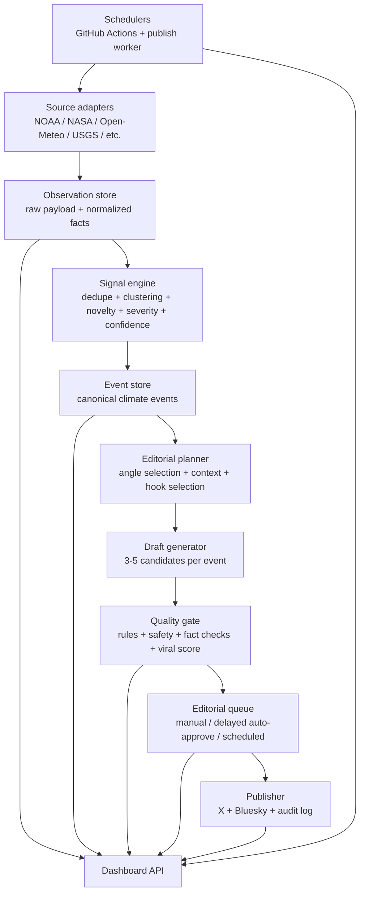

# @theheat Future State

Last updated: April 8, 2026 (forward-looking architecture doc — see "Progress against plan" below for what's actually shipped since).

> **Current state pointer (2026-06-09):** This doc hasn't been meaningfully refreshed since April. For the actual current state see [/Users/andrewpuschel/Documents/Claude/theheat/BRIEFING.md](/Users/andrewpuschel/Documents/Claude/theheat/BRIEFING.md), [/Users/andrewpuschel/Documents/Claude/theheat/CHANGELOG.md](/Users/andrewpuschel/Documents/Claude/theheat/CHANGELOG.md) 0.9.20.0, and the canonical handoff at [/Users/andrewpuschel/Documents/Claude/theheat/docs/handoffs/2026-06-09-v2.md](/Users/andrewpuschel/Documents/Claude/theheat/docs/handoffs/2026-06-09-v2.md). **The @extremetemps coverage lane is COMPLETE** (Wave 1 + SST + Part B reanalysis anomaly, all `manual_only`; reganom is landed but DORMANT pending the `THEHEAT_REGANOM_ENABLED=1` flip). A super-detailed tech-stack review (2026-06-09) set the next architectural backlog — **a declarative `MERGE_SPEC`** to replace the error-prone hand-rolled `_merge_state` (it caused 3 silent state-loss bugs this session; strong-recommend next), `common.py` decomposition (1687-line god-module), unbounded record-store caps, deciding the dual-SQLite backend's fate, a `requests.Session` for connection pooling, and the missing source-runner abstraction. Database migration off Gist is **still not started**, but the gist was made ~39% smaller (write minified, 0.9.20.0) and the truncation cliff that took prod down 2026-05-13 is defused. The editorial pipeline (sources → triage → evidence contract → writer → safety → fact_check → critic) is complete end-to-end across all 23 sources; `theheat-bot` is active. Source reliability is now self-monitoring: a daily source-health sentinel (0.9.12–0.9.13) files/auto-closes a GitHub issue per failing source, and the dashboard (0.9.14.0) distinguishes `external` (NASA/gov) from our-bug failures. The daily-plan grading routine was **restored 2026-06-08** (down 05-26→06-07; root cause was an unbound repo, fixed in the Routines UI), the gpm precipitation feed is **live on `datapool`** (0.9.15.0, ~2s grid fetch), and the pending TTL is now **per-type** (0.9.16.0; coral/DHW 21d). Posting remains `manual_only` — the flip is now gated on **editorial supply + an A-rate window, not infrastructure**. The **@extremetemps coverage lane** is shipping: **Wave 1 LANDED 2026-06-08** (absolute-extreme, wet-bulb, air-quality PM2.5/dust — all `manual_only`, 0.9.17.0); **SST regional anomaly** (gridded NOAA Coral Reef Watch) is **Wave 2, in flight**; **Part B regional reanalysis anomaly** is **Rev-3 build-ready** (build-LAST, after SST). See the canonical handoff.

## Progress against plan (as of 2026-05-12)

- **Phase 0 (Stabilize production)** — largely shipped. Suppression ledger (#54-#60), source-health visibility (#64, #71), CI on PRs (#56), hermeticity gate (#57), anti-fabrication safety (#58-#60), nightly voice-replay regression (#61), ruff + mypy gates (#62-#63, #72), fact-checker as third boundary (#82). Database migration off Gist *not yet started*; Gist remains the durable state with a `BotState` TypedDict (#72) now enforcing structure in-process.
- **Phase 1 (Editorial data model)** — partial. Suppression ledger gives us `runs`/`source_runs`/`drafts`/`event_scores` equivalents inside the Gist payload. Event clustering exists per-city; cross-city clustering still aspirational. Multi-source observation persistence still aspirational.
- **Phase 2 (Generation quality)** — partial. Two-bot pipeline (Sonnet writer + Gemini fact-check, #43) plus the Attenborough/Economist voice direction (#74-#75), code-side length retry + KILL (#76), JSON-parse retry + KILL (#82), bundle-side FRP rounding (#80), and 6 approved exemplars cover the "single-candidate quality" path. Multi-candidate generation + performance-based evals from published tweets still aspirational.
- **Phase 3 (Dashboard)** — partial. Suppressed tab, Sources tab, refresh feedback (#78) shipped; Editorial Desk / Workbench / Run Center evolution ongoing.
- **Phase 4 (Visual media)** — not started.

## Thesis

@theheat should evolve from "a good bot with an admin page" into a compact climate newsroom system:

1. The input logic decides what is actually worth saying.
2. The writing system produces multiple high-upside drafts, not just one acceptable draft.
3. The dashboard explains what the bot saw, why it acted, what is queued, what failed, and what will happen next.

The goal is not more automation for its own sake. The goal is a system that is selective, legible, and consistently publishable.

## Product Future State

### What the product becomes

The future version of @theheat is a three-layer product:

- Signal engine: watches all sources, normalizes observations, deduplicates them, and scores their editorial value.
- Editorial engine: turns the best events into multiple tweet candidates, scores them for clarity and shareability, and routes them into approval policies.
- Publishing engine: handles manual approval, delayed auto-approval, scheduled posting, retries, cross-posting, and postmortems.

### Product principles

- Data first, but not data raw. The system should summarize and prioritize, not dump.
- Editorial taste must be encoded. The system should know why a Phoenix record matters more than an ordinary warm day.
- Every draft needs provenance. A human reviewer should see the sources, thresholds, anomalies, and reason the draft exists.
- Viral does not mean sloppy. Shareability should come from contrast, surprise, timing, and context, not bait.
- Reliability is a feature. "Looks like it worked" is not enough for a publishing system.

## System Architecture

### Recommended core data model

Move mutable state out of a single Gist and into a real datastore. Free-tier Postgres is the cleanest fit because the product is now an editorial workflow, not just a settings blob.

Suggested tables:

- `runs`: one row per scheduled or manual run.
- `source_runs`: per-source timing, status, quota, and error details.
- `observations`: raw and normalized payloads from each source.
- `events`: deduplicated editorial objects built from one or more observations.
- `event_scores`: novelty, severity, confidence, shareability, and final editorial score.
- `drafts`: the chosen draft plus state machine fields.
- `draft_variants`: alternate tweet candidates and their scores.
- `approval_rules`: per-type approval policies, including delayed auto-approval windows.
- `publish_jobs`: due time, destination, retries, final result.
- `posts`: final published posts with URLs and timestamps.

### Why this architectural shift matters

The current architecture treats the world as "state JSON + pending drafts." That is enough to operate a bot, but not enough to operate an editorial system. The future state needs durable records for runs, source health, event decisions, candidate drafts, and publishing outcomes.

## Smart Input Logic

### The signal engine

Every source should emit a normalized observation with consistent fields:

- `event_type`
- `location`
- `observed_at`
- `source`
- `source_confidence`
- `magnitude`
- `baseline`
- `anomaly`
- `historical_context`
- `seasonality_context`
- `dedupe_key`
- `human_impact_risk`

### Event scoring

Each event gets independent scores before any tweet is written:

- Severity: how large is the physical signal?
- Novelty: is this rare for this place, this date, or this category?
- Familiarity break: does it violate what a casual observer expects?
- Timeliness: is it fresh now, or already stale?
- Confidence: how certain is the source or confirmation?
- Shareability: does it contain a clean contrast, comparison, or punchline?
- Sensitivity: should humor be reduced or removed because of harm context?

The editorial score should combine those into a single ranking. Low-signal items never reach draft generation.

### Draft-worthy logic

The system should explicitly favor:

- New record highs or lows with strong historical context.
- Out-of-season anomalies.
- "Same place, again" streaks with cultural recognition.
- Big year-over-year or pre-industrial comparisons.
- Events with clean human-readable scale references.
- Multi-source confirmation or escalation.

The system should explicitly suppress:

- Duplicate signals from the same incident unless there is a meaningful update.
- Weak anomalies with no clean contextual hook.
- Alerts that are operationally noisy but not editorially distinct.
- Events where humor would create tone risk.

## Outstanding Viral Tweets

### Replace single-shot generation with an editorial loop

For each high-scoring event:

1. Build an event brief with facts, comparisons, historical context, and allowed tone.
2. Generate 3 to 5 tweet candidates with different angles.
3. Run each through the same safety and rules pipeline.
4. Score each draft on clarity, specificity, self-contained context, and punch.
5. Save the best candidate and retain the alternates for review.

### Candidate scoring rubric

Each draft should be scored on:

- Clarity: can a first-time reader understand it instantly?
- Context density: does it explain why the number matters?
- Memorability: does it have a clean punchline or contrast?
- Screenshottability: would this survive outside the feed?
- Voice fidelity: does it sound like @theheat and not a generic AI summary?
- Risk: does the framing edge toward preachy, cruel, vague, or sensational?

### Build an eval set from actual performance

Once there is enough posting history, the system should maintain a reference set of:

- Top-performing tweets by impressions, reposts, likes, and screenshot potential.
- Near-miss tweets that were factually fine but flat.
- Unsafe or off-brand outputs that should never recur.

That turns "virality" from taste alone into a measurable feedback loop.

## Dashboard Future State

### Core jobs for the dashboard

The dashboard should stop being just a trigger surface and become the operating console for the bot.

Primary surfaces:

- Editorial Desk: queue, what is ready, what is blocked, what will auto-approve next.
- Draft Workbench: compare candidates, inspect source facts, edit, approve, hold, reject, or schedule.
- Run Center: source health, active runs, timing, payload counts, failures, retries, and quotas.
- Composer: manually write a tweet, generate variants, route to queue, or publish immediately.
- Rules: approval windows, source thresholds, posting windows, quiet hours, and auto-approve policies.

### Required workflow features

- Review queue with status lanes: `needs_review`, `auto_approving`, `scheduled`, `publishing`, `posted`, `failed`.
- Delayed auto-approval by rule:
  Examples: low-risk leaderboard posts after 20 minutes, CO2 milestones after 60 minutes, disaster items never auto-approve.
- Full provenance:
  Every draft shows event facts, source URLs, scoring breakdown, and alternates.
- Manual compose:
  Human-written tweets should go through the same length, safety, and publishing pipeline as generated tweets.
- Live system state:
  Show what each source did in the last run and what the next run is expected to do.

### Reliability and observability standards

- Every run gets a permanent run record.
- Every source gets timing, item counts, and error logs.
- Every draft gets a clear lineage from observations to event to variants to post.
- Every failure becomes visible in the dashboard with a suggested fix path.
- Every state transition is auditable.

## Engineering Review

### What is strong today

- The project already has breadth across useful climate sources.
- The voice is well-defined and unusually strong for an automation project.
- The Python core is straightforward and test-friendly.
- Human review before posting is the right default.

### Current architectural risks

1. Single mutable Gist state is the system bottleneck.
   The bot and dashboard both read and rewrite the same JSON blob. That creates silent overwrite risk and makes observability impossible.

2. The dashboard writes whole-state patches without robust validation.
   Several API routes patch the Gist and do not verify the write as a first-class operation.

3. Manual compose does not share the same editorial pipeline.
   A hand-written tweet can be dispatched to publishing without the same generation-time safety and provenance path.

4. There is no durable run ledger.
   Workflow status is visible, but source-level results, counts, and decisions are not.

5. The orchestration file is doing too much in one process.
   `src/main.py` has become a full system coordinator, draft manager, and publisher entrypoint.

6. Cross-posting is described as a product behavior but is not integrated into the main post path.

7. Data fetch performance is dominated by sequential network calls.
   This is survivable today, but it is the wrong shape for a system that should become more selective and more observable.

8. Deployment trust is weak.
   The current deployed dashboard is behind Vercel auth and is also described as lagging behind the repo. That makes operational review harder than it should be.

### Engineering recommendation

Refactor toward four services inside the same repo:

- `signal`: adapters, normalization, clustering, scoring.
- `editorial`: briefing, generation, candidate scoring, approval routing.
- `publishing`: schedule queue, posting, retries, post ledger.
- `dashboard`: read-heavy UI over explicit tables, not a state blob.

This does not require microservices. It requires cleaner boundaries and a real persistence layer.

## Design Plan

### UX direction

Keep the dark operations-room feel, but make it feel like an editorial desk rather than a terminal demo.

Visual direction:

- A warm ember palette instead of pure orange accents only.
- Serif headlines for gravity, monospace only where data density helps.
- Clear hierarchy between "what needs me now" and "background telemetry."
- Motion used sparingly for countdowns, publishing state, and live run transitions.

### IA

Recommended navigation:

- Desk
- Drafts
- Runs
- Sources
- Compose
- Rules

### Design principles

- The most important action should always be obvious in under 3 seconds.
- Every draft should answer: what happened, why did we generate this, what are my options?
- The UI should surface confidence, novelty, and risk, not just raw status.
- Power-user friendly does not mean opaque.

## Rollout Plan

### Phase 0: Stabilize production

- Fix token and deployment issues.
- Add write verification and visible error reporting.
- Add a database and migrate off Gist for mutable editorial state.
- Add run records and source-run records before changing product logic.

### Phase 1: Build the editorial data model

- Normalize all sources into observations.
- Create event clustering and event scoring.
- Persist draft variants and approval policies.
- Route manual compose into the same queue model.

### Phase 2: Upgrade generation quality

- Add multi-candidate generation.
- Add candidate scoring and alternate variants.
- Add performance-based evals from published tweets.
- Introduce category-specific templates for record, streak, CO2, fire, and quiet-day formats.

### Phase 3: Upgrade the dashboard

- Ship Editorial Desk, Draft Workbench, and Run Center.
- Add delayed auto-approval with cancel windows.
- Add schedule controls, quiet hours, and policy management.
- Add source-health drilldowns and failed-item replay.

### Phase 4: Add visual media

- Generate cards for Hot 10, record events, and streaks.
- Support image review and image-specific approval.
- Track whether image tweets outperform text-only tweets by category.

## The bar for "works perfectly"

No system works perfectly in the literal sense, but this future state can behave like a serious newsroom tool:

- The bot always knows what it saw.
- The dashboard always explains what happened.
- Every draft has a reason to exist.
- Publishing is delayed, observable, reversible, and auditable.
- The best events get the best writing.

That is the right standard for @theheat.
